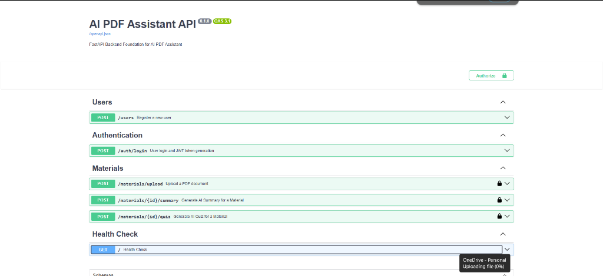

# AI PDF Assistant API

A high-performance, modular FastAPI backend service designed to process PDF documents using full-page Optical Character Recognition (OCR) and Google's Gemini Generative AI. The application enables authenticated users to upload PDF materials, perform page-level image rendering and Tesseract OCR, generate structured AI summaries, and generate 10-question multiple-choice quizzes that are persisted in SQLite with secured correct answers.


## Technology Stack

| Technology | Requirement / Version | Role & Purpose |
| :--- | :--- | :--- |
| **Python** | `^3.11` | Primary programming language |
| **FastAPI** | `>=0.110.0` | High-performance ASGI Web Framework |
| **Uvicorn** | `>=0.28.0` | Lightning-fast ASGI Server |
| **SQLAlchemy** | `>=2.0.28` | Relational ORM & Database abstraction |
| **SQLite** | Built-in | Embedded relational database engine (`ai_pdf_assistant.db`) |
| **Pydantic** | `>=2.6.4` | Data validation, settings loading, and schema serialization |
| **Pydantic Settings** | `>=2.2.1` | Environment variable management |
| **PyMuPDF** | `>=1.24.0` | High-speed PDF page rendering engine (`get_pixmap`) |
| **Tesseract OCR / pytesseract** | `>=0.3.10` | Optical Character Recognition engine & Python wrapper |
| **Pillow** | `>=10.0.0` | In-memory image processing library for pytesseract |
| **Google Gemini API** | `>=0.1.0` | Generative AI SDK (`google-genai` / `gemini-2.5-flash`) |
| **PyJWT** | `>=2.8.0` | JSON Web Token encoding and decoding |
| **pwdlib[argon2]** | `>=0.2.0` | Secure password hashing using Argon2 algorithm |
| **python-multipart** | `>=0.0.12` | Multipart form-data handling for file uploads |

---


## API Endpoints Reference



| Method | Endpoint | Authentication | Description |
| :--- | :--- | :--- | :--- |
| `GET` | `/` | Public | Application health-check endpoint |
| `POST` | `/users` | Public | Register a new user account |
| `POST` | `/auth/login` | Public | Authenticate user credentials and receive JWT access token |
| `POST` | `/materials/upload` | Bearer JWT | Upload a PDF document and record material metadata |
| `POST` | `/materials/{id}/summary` | Bearer JWT | Render PDF pages, run Tesseract OCR, and generate AI summary |
| `POST` | `/materials/{id}/quiz` | Bearer JWT | Render PDF, run OCR, generate 10-question MCQ quiz, & persist in SQLite |
| `GET` | `/docs` | Public | Auto-generated interactive Swagger UI documentation |
| `GET` | `/redoc` | Public | Auto-generated ReDoc interactive documentation |

---

## Authentication & Authorization

1. **User Registration (`POST /users`)**: Accepts `username`, `email`, and `password`. Passwords are hashed using the Argon2 algorithm via `pwdlib`.
2. **User Login (`POST /auth/login`)**: Accepts OAuth2 form-data (`username`, `password`). Returns a signed JWT access token (`access_token`, `token_type: bearer`).
3. **Route Protection**: Endpoints require the `Authorization: Bearer <access_token>` header. The `get_current_user` dependency decodes the JWT signature, verifies expiration, and injects the authenticated `User` ORM instance.
4. **Resource Ownership Enforcement**: Endpoints `/materials/{id}/summary` and `/materials/{id}/quiz` verify that `material.user_id == current_user.id`. Access attempts by unauthorized users return an explicit `403 Forbidden` response.

---

## PDF Upload & Physical Storage

- **Endpoint**: `POST /materials/upload`
- **Validation**: Accepts multipart `UploadFile`. Validates both `.pdf` file extension and `%PDF` magic bytes header.
- **Physical Storage**: PDF files are assigned a unique 32-character hex UUID (`uploads/<uuid>.pdf`) and saved in the `uploads/` directory on disk.
- **Database Recording**: Inserts a `Material` record storing `filename`, `file_path`, `user_id`, and `created_at` timestamp.

---

## OCR Pipeline Architecture

The application uses **full-page OCR** to guarantee complete text extraction across all document formats:

```text
PDF Document Page
      │
      ▼
PyMuPDF (fitz) renders complete page at 200 DPI → Image Pixmap Buffer
      │
      ▼
Pillow converts Pixmap PNG bytes → In-Memory PIL Image
      │
      ▼
pytesseract executes Tesseract OCR on full page image
      │
      ▼
Raw OCR Text → clean_extracted_text() whitespace normalization
```

### Key Capabilities:
- **Full Canvas Coverage**: Renders the complete page canvas as an image rather than relying on embedded text objects.
- **Handles Mixed Content**: Processes normal text PDFs, scanned/image PDFs, and mixed pages containing both selectable vector text and embedded images with text.
- **Text Cleaning**: Standardizes carriage returns (`\r\n` $\rightarrow$ `\n`), collapses multi-spaces/tabs, and preserves paragraph breaks (`\n\n`).

> [!NOTE]
> **System Requirement for Tesseract OCR**:  
> Standard text processing requires the Tesseract OCR engine binary installed on the operating system:
> - **Windows**: Download installer from [UB-Mannheim Tesseract Wiki](https://github.com/UB-Mannheim/tesseract/wiki). Ensure `tesseract.exe` is in system `PATH` or set `TESSERACT_CMD`.
> - **Linux (Ubuntu/Debian)**: `sudo apt-get install tesseract-ocr`
> - **macOS**: `brew install tesseract`

---


## Database Models & Schema

The application uses an SQLite database (`ai_pdf_assistant.db`) managed via SQLAlchemy 2.x ORM models:

- **`User`**: `id`, `username`, `email`, `password_hash`, `created_at`.
- **`Material`**: `id`, `user_id` (FK $\rightarrow$ `users.id`), `filename`, `file_path`, `created_at`.
- **`Quiz`**: `id`, `material_id` (FK $\rightarrow$ `materials.id`), `user_id` (FK $\rightarrow$ `users.id`), `total_questions`, `created_at`.
- **`QuizQuestion`**: `id`, `quiz_id` (FK $\rightarrow$ `quizzes.id`), `question_order`, `question_text`, `option_a`, `option_b`, `option_c`, `option_d`, `correct_answer`, `explanation`.

---

## Environment Variables Configuration

Copy `.env.example` to `.env` and fill in your configuration:

```bash
cp .env.example .env
```

### Safe Environment Template (`.env.example`):
```env
PROJECT_NAME="AI PDF Assistant API"
PROJECT_VERSION="0.1.0"

# Database Configuration (SQLite default)
DATABASE_URL="sqlite:///./ai_pdf_assistant.db"

# JWT Security Configuration
SECRET_KEY="your-secret-key-change-this-in-production"
ALGORITHM="HS256"
ACCESS_TOKEN_EXPIRE_MINUTES=30

# Gemini API Configuration
GEMINI_API_KEY="your-gemini-api-key-here"
```

---

## Setup & Local Installation

### 1. Create Virtual Environment
**Windows (PowerShell):**
```powershell
python -m venv venv
.\venv\Scripts\Activate.ps1
```
**Linux / macOS:**
```bash
python3 -m venv venv
source venv/bin/activate
```

### 2. Install Python Dependencies
```bash
pip install -r requirements.txt
```

### 3. Run Development Server
```bash
uvicorn app.main:app --reload
```
The application will start at `http://127.0.0.1:8000`.

---

## Testing & Verification

### Automated Test Suites
Run the automated test suites using the virtual environment Python interpreter:

```powershell
# Run Authentication & Username Login Test Suite
.\venv\Scripts\python.exe -m tests.test_auth_api

# Run OCR Service Test Suite
.\venv\Scripts\python.exe -m tests.test_pdf_service

# Run Summary API Test Suite
.\venv\Scripts\python.exe -m tests.test_summary_api

# Run Quiz API Test Suite
.\venv\Scripts\python.exe -m tests.test_quiz_api
```

### Interactive Swagger UI Testing Walkthrough
1. Start the server: `uvicorn app.main:app --reload`
2. Open Swagger UI at `http://127.0.0.1:8000/docs`.
3. Register a user via `POST /users` (`username`, `email`, `password`).
4. Log in via `POST /auth/login` to obtain your `access_token`.
5. Click **Authorize** (top right) and enter `Bearer <access_token>`.
6. Upload a PDF via `POST /materials/upload` and copy the returned material `id`.
7. Execute `POST /materials/{id}/summary` to view the generated AI summary.
8. Execute `POST /materials/{id}/quiz` to generate and persist the 10-question MCQ quiz.
9. Query SQLite to verify database persistence of correct answers:
   ```powershell
   sqlite3 ai_pdf_assistant.db "SELECT id, quiz_id, question_order, correct_answer FROM quiz_questions;"
   ```
